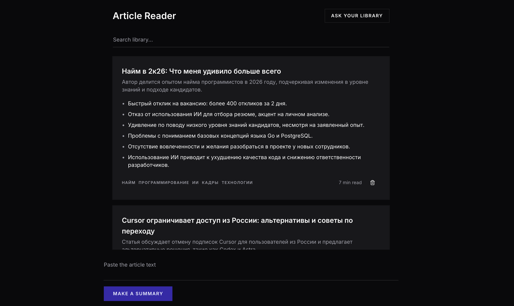

# Article Reader

**[Live demo](https://article-reader-neon.vercel.app/)**

AI-powered article summarizer. Paste a link or raw text — get a structured
breakdown: summary, key points, tags, and estimated reading time.



## Stack

- **Next.js 16** (App Router)
- **React 19**
- **Vercel AI SDK 7** — model calls and structured output
- **OpenAI** `gpt-4o-mini`
- **Zod** — schema definition and runtime validation
- **Prisma 7** — ORM and migrations
- **Neon** — serverless PostgreSQL
- **@mozilla/readability + linkedom** — article extraction
- **shadcn/ui + Tailwind CSS**
- **TypeScript 5**
- **pgvector** — vector similarity search

## Getting started

```bash
npm install
```

Create `.env.local` in the project root:

```
OPENAI_API_KEY=sk-proj-...
DATABASE_URL=postgresql://...          # direct connection, used for migrations
DATABASE_URL_POOLED=postgresql://...   # pooled connection, used by the app
```

Apply the schema and generate the Prisma client:

```bash
npx prisma migrate dev
```

Then:

```bash
npm run dev
```

Open [localhost:3000](http://localhost:3000).

## How it works

1. User submits a URL or raw article text.
2. If it's a URL, `/api/extract` fetches the page and strips navigation, ads,
   and comments with Readability, leaving the article body.
3. `/api/summarize` sends the text to the model with a Zod schema attached.
   The SDK constrains the output and validates it before returning.
4. The result is written to Postgres and returned with its generated `id` and
   `createdAt`. The library loads from `/api/summaries` on mount, newest first.
5. On save, an embedding of the summary is stored alongside it. `/api/ask`
   embeds the question, finds the three nearest summaries by cosine distance,
   and passes them to the model as context.
